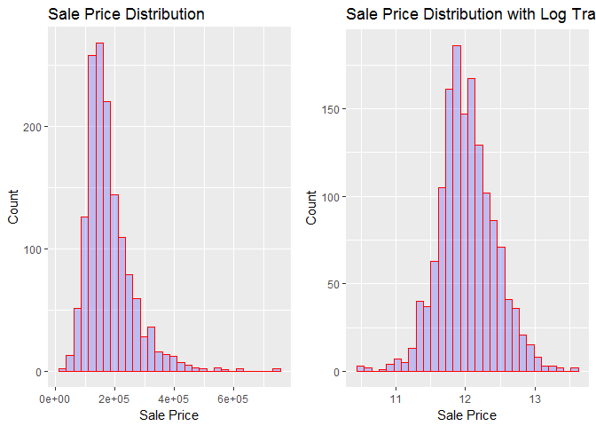
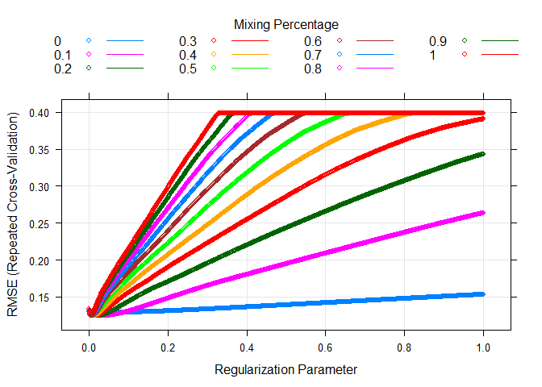

Housing Price Regresison
================
Joey Bringley
October 6, 2017

``` r
library(caret)
library(e1071)
library(gridExtra)
```

Load in the data
----------------

``` r
setwd('~/ML/HousingPrices')
train <- read.csv('train.csv', stringsAsFactors=F)
test <- read.csv('test.csv', stringsAsFactors=F)
full <- rbind(within(train, rm('Id', 'SalePrice')), within(test, rm('Id')))
```

``` r
dim(train)
```

    ## [1] 1460   81

``` r
str(train)
```

    ## 'data.frame':    1460 obs. of  81 variables:
    ##  $ Id           : int  1 2 3 4 5 6 7 8 9 10 ...
    ##  $ MSSubClass   : int  60 20 60 70 60 50 20 60 50 190 ...
    ##  $ MSZoning     : chr  "RL" "RL" "RL" "RL" ...
    ##  $ LotFrontage  : int  65 80 68 60 84 85 75 NA 51 50 ...
    ##  $ LotArea      : int  8450 9600 11250 9550 14260 14115 10084 10382 6120 7420 ...
    ##  $ Street       : chr  "Pave" "Pave" "Pave" "Pave" ...
    ##  $ Alley        : chr  NA NA NA NA ...
    ##  $ LotShape     : chr  "Reg" "Reg" "IR1" "IR1" ...
    ##  $ LandContour  : chr  "Lvl" "Lvl" "Lvl" "Lvl" ...
    ##  $ Utilities    : chr  "AllPub" "AllPub" "AllPub" "AllPub" ...
    ##  $ LotConfig    : chr  "Inside" "FR2" "Inside" "Corner" ...
    ##  $ LandSlope    : chr  "Gtl" "Gtl" "Gtl" "Gtl" ...
    ##  $ Neighborhood : chr  "CollgCr" "Veenker" "CollgCr" "Crawfor" ...
    ##  $ Condition1   : chr  "Norm" "Feedr" "Norm" "Norm" ...
    ##  $ Condition2   : chr  "Norm" "Norm" "Norm" "Norm" ...
    ##  $ BldgType     : chr  "1Fam" "1Fam" "1Fam" "1Fam" ...
    ##  $ HouseStyle   : chr  "2Story" "1Story" "2Story" "2Story" ...
    ##  $ OverallQual  : int  7 6 7 7 8 5 8 7 7 5 ...
    ##  $ OverallCond  : int  5 8 5 5 5 5 5 6 5 6 ...
    ##  $ YearBuilt    : int  2003 1976 2001 1915 2000 1993 2004 1973 1931 1939 ...
    ##  $ YearRemodAdd : int  2003 1976 2002 1970 2000 1995 2005 1973 1950 1950 ...
    ##  $ RoofStyle    : chr  "Gable" "Gable" "Gable" "Gable" ...
    ##  $ RoofMatl     : chr  "CompShg" "CompShg" "CompShg" "CompShg" ...
    ##  $ Exterior1st  : chr  "VinylSd" "MetalSd" "VinylSd" "Wd Sdng" ...
    ##  $ Exterior2nd  : chr  "VinylSd" "MetalSd" "VinylSd" "Wd Shng" ...
    ##  $ MasVnrType   : chr  "BrkFace" "None" "BrkFace" "None" ...
    ##  $ MasVnrArea   : int  196 0 162 0 350 0 186 240 0 0 ...
    ##  $ ExterQual    : chr  "Gd" "TA" "Gd" "TA" ...
    ##  $ ExterCond    : chr  "TA" "TA" "TA" "TA" ...
    ##  $ Foundation   : chr  "PConc" "CBlock" "PConc" "BrkTil" ...
    ##  $ BsmtQual     : chr  "Gd" "Gd" "Gd" "TA" ...
    ##  $ BsmtCond     : chr  "TA" "TA" "TA" "Gd" ...
    ##  $ BsmtExposure : chr  "No" "Gd" "Mn" "No" ...
    ##  $ BsmtFinType1 : chr  "GLQ" "ALQ" "GLQ" "ALQ" ...
    ##  $ BsmtFinSF1   : int  706 978 486 216 655 732 1369 859 0 851 ...
    ##  $ BsmtFinType2 : chr  "Unf" "Unf" "Unf" "Unf" ...
    ##  $ BsmtFinSF2   : int  0 0 0 0 0 0 0 32 0 0 ...
    ##  $ BsmtUnfSF    : int  150 284 434 540 490 64 317 216 952 140 ...
    ##  $ TotalBsmtSF  : int  856 1262 920 756 1145 796 1686 1107 952 991 ...
    ##  $ Heating      : chr  "GasA" "GasA" "GasA" "GasA" ...
    ##  $ HeatingQC    : chr  "Ex" "Ex" "Ex" "Gd" ...
    ##  $ CentralAir   : chr  "Y" "Y" "Y" "Y" ...
    ##  $ Electrical   : chr  "SBrkr" "SBrkr" "SBrkr" "SBrkr" ...
    ##  $ X1stFlrSF    : int  856 1262 920 961 1145 796 1694 1107 1022 1077 ...
    ##  $ X2ndFlrSF    : int  854 0 866 756 1053 566 0 983 752 0 ...
    ##  $ LowQualFinSF : int  0 0 0 0 0 0 0 0 0 0 ...
    ##  $ GrLivArea    : int  1710 1262 1786 1717 2198 1362 1694 2090 1774 1077 ...
    ##  $ BsmtFullBath : int  1 0 1 1 1 1 1 1 0 1 ...
    ##  $ BsmtHalfBath : int  0 1 0 0 0 0 0 0 0 0 ...
    ##  $ FullBath     : int  2 2 2 1 2 1 2 2 2 1 ...
    ##  $ HalfBath     : int  1 0 1 0 1 1 0 1 0 0 ...
    ##  $ BedroomAbvGr : int  3 3 3 3 4 1 3 3 2 2 ...
    ##  $ KitchenAbvGr : int  1 1 1 1 1 1 1 1 2 2 ...
    ##  $ KitchenQual  : chr  "Gd" "TA" "Gd" "Gd" ...
    ##  $ TotRmsAbvGrd : int  8 6 6 7 9 5 7 7 8 5 ...
    ##  $ Functional   : chr  "Typ" "Typ" "Typ" "Typ" ...
    ##  $ Fireplaces   : int  0 1 1 1 1 0 1 2 2 2 ...
    ##  $ FireplaceQu  : chr  NA "TA" "TA" "Gd" ...
    ##  $ GarageType   : chr  "Attchd" "Attchd" "Attchd" "Detchd" ...
    ##  $ GarageYrBlt  : int  2003 1976 2001 1998 2000 1993 2004 1973 1931 1939 ...
    ##  $ GarageFinish : chr  "RFn" "RFn" "RFn" "Unf" ...
    ##  $ GarageCars   : int  2 2 2 3 3 2 2 2 2 1 ...
    ##  $ GarageArea   : int  548 460 608 642 836 480 636 484 468 205 ...
    ##  $ GarageQual   : chr  "TA" "TA" "TA" "TA" ...
    ##  $ GarageCond   : chr  "TA" "TA" "TA" "TA" ...
    ##  $ PavedDrive   : chr  "Y" "Y" "Y" "Y" ...
    ##  $ WoodDeckSF   : int  0 298 0 0 192 40 255 235 90 0 ...
    ##  $ OpenPorchSF  : int  61 0 42 35 84 30 57 204 0 4 ...
    ##  $ EnclosedPorch: int  0 0 0 272 0 0 0 228 205 0 ...
    ##  $ X3SsnPorch   : int  0 0 0 0 0 320 0 0 0 0 ...
    ##  $ ScreenPorch  : int  0 0 0 0 0 0 0 0 0 0 ...
    ##  $ PoolArea     : int  0 0 0 0 0 0 0 0 0 0 ...
    ##  $ PoolQC       : chr  NA NA NA NA ...
    ##  $ Fence        : chr  NA NA NA NA ...
    ##  $ MiscFeature  : chr  NA NA NA NA ...
    ##  $ MiscVal      : int  0 0 0 0 0 700 0 350 0 0 ...
    ##  $ MoSold       : int  2 5 9 2 12 10 8 11 4 1 ...
    ##  $ YrSold       : int  2008 2007 2008 2006 2008 2009 2007 2009 2008 2008 ...
    ##  $ SaleType     : chr  "WD" "WD" "WD" "WD" ...
    ##  $ SaleCondition: chr  "Normal" "Normal" "Normal" "Abnorml" ...
    ##  $ SalePrice    : int  208500 181500 223500 140000 250000 143000 307000 200000 129900 118000 ...

``` r
sparsity <- round(sum(is.na(train))/(nrow(train)*ncol(train))*100, digits=2)
sparsity ## sparsity is around 6%
```

    ## [1] 5.89

Examine the missing data
------------------------

``` r
null_counts <- colSums(sapply(full, is.na))
null_features <- null_counts[null_counts > 0]
sort(null_features, decreasing=T)
```

    ##       PoolQC  MiscFeature        Alley        Fence  FireplaceQu 
    ##         2909         2814         2721         2348         1420 
    ##  LotFrontage  GarageYrBlt GarageFinish   GarageQual   GarageCond 
    ##          486          159          159          159          159 
    ##   GarageType     BsmtCond BsmtExposure     BsmtQual BsmtFinType2 
    ##          157           82           82           81           80 
    ## BsmtFinType1   MasVnrType   MasVnrArea     MSZoning    Utilities 
    ##           79           24           23            4            2 
    ## BsmtFullBath BsmtHalfBath   Functional  Exterior1st  Exterior2nd 
    ##            2            2            2            1            1 
    ##   BsmtFinSF1   BsmtFinSF2    BsmtUnfSF  TotalBsmtSF   Electrical 
    ##            1            1            1            1            1 
    ##  KitchenQual   GarageCars   GarageArea     SaleType 
    ##            1            1            1            1

Examine Numeric Features
------------------------

``` r
feature_classes <- sapply(full, class)
numeric_features <- names(feature_classes[feature_classes != "character"])
```

Compute skewness for each numeric feature

``` r
feature_skewness <- sapply(numeric_features, function(x){
  skewness(full[,x], na.rm=TRUE)
})
```

Keep only features that exceed a threshold, here we will use 0.75 Transform skewed features with transformation: log(x+1)

``` r
## keep only features that exceed a threshold, here we will use 0.75
feature_skewness <- feature_skewness[feature_skewness > 0.75]
for(i in names(feature_skewness)){
  full[, i] <- log(full[, i] + 1)
}
```

Use the mean to handle null cases for numeric features

``` r
for(j in numeric_features){
  avg <- mean(full[, j], na.rm=T)
  full[is.na(full[, j]), j] <- avg
}
```

Examine Categorical Features
----------------------------

Use caret dummyVar functions for hot one encoding for categorical features

``` r
categorical_features <- names(feature_classes[feature_classes=="character"])

dummies <- dummyVars(~., full[categorical_features])
cat_one_hot <- predict(dummies, full[categorical_features])
cat_one_hot[is.na(cat_one_hot)] <- 0 # for any level that was NA, set to zero
```

Examine Predictor
-----------------

``` r
plot1 <- qplot(train$SalePrice, geom="histogram", xlab="Sale Price",
               ylab="Count", main="Sale Price Distribution",
               fill=I('blue'), col=I('red'), alpha=I(.2))
plot2 <- qplot(log(train$SalePrice+1), geom="histogram", xlab="Sale Price", 
               ylab="Count", main="Sale Price Distribution with Log Transformation",
               fill=I('blue'), col=I('red'), alpha=I(.2))
grid.arrange(plot1, plot2, ncol=2)
```

    ## `stat_bin()` using `bins = 30`. Pick better value with `binwidth`.
    ## `stat_bin()` using `bins = 30`. Pick better value with `binwidth`.



``` r
skewness(train$SalePrice)
```

    ## [1] 1.879009

Since we see the distribution is skewed right, perform log transformation

``` r
train$SalePrice <- log(train$SalePrice + 1)
```

Merge Pre-Processed Data
------------------------

``` r
final <- cbind(full[numeric_features], cat_one_hot)
training <- final[1:nrow(train), ]
testing <- final[(nrow(train)+1):nrow(full), ]
y <- train$SalePrice
sum(is.na(final)) ## make sure dataframe contains zero nulls
```

    ## [1] 0

Model Setup
-----------

``` r
train_ctrl <- trainControl(method="repeatedcv",
                           number=10, 
                           repeats=3,
                           verboseIter=FALSE)
```

Elastic Net Regression
----------------------

Elastic Net is used here because it solves the limiations of LASSO and Ridge regression while also including them as special cases (when alpha equals zero or one).

``` r
lambda_grid <- seq(0, 1, by=0.001)
alpha_grid <- seq(0, 1, by=0.1)
srch_grid <- expand.grid(.alpha=alpha_grid, .lambda=lambda_grid)
## model
set.seed(5594)
elastic_fit <- train(x=training,
             y=y,
             method='glmnet',
             tuneGrid=srch_grid,
             trControl=train_ctrl,
             standardize=TRUE)
```

    ## Loading required package: glmnet

    ## Loading required package: Matrix

    ## Loading required package: foreach

    ## Loaded glmnet 2.0-10

``` r
plot(elastic_fit)
```



``` r
elastic_fit$bestTune
```

    ##      alpha lambda
    ## 2021   0.2  0.018

``` r
mean(elastic_fit$resample$RMSE)
```

    ## [1] 0.1243956

### Predictions and Submission

``` r
elastic_preds <- exp(predict(elastic_fit, newdata=testing)) -1
elastic_sol <- data.frame(Id=as.integer(rownames(testing)), SalePrice=elastic_preds)
write.csv(elastic_sol, "elastic_solution.csv", row.names=F)
```
